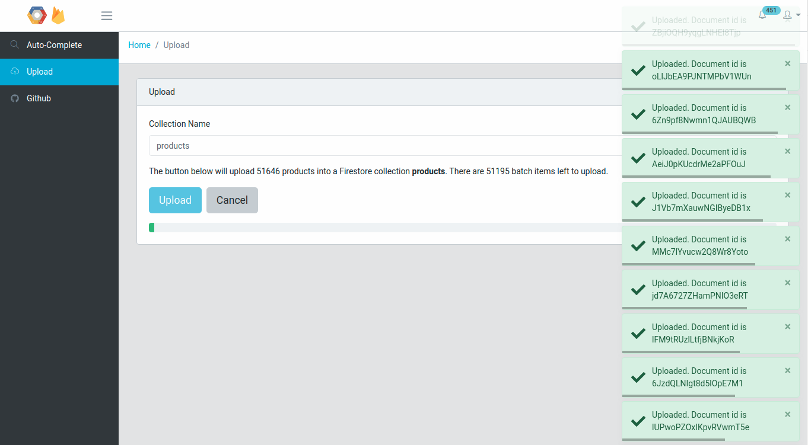

# Autocomplete Angular

[Angular](https://angular.io/) and [Bootstrap](https://getbootstrap.com/) application run on an [Express](https://expressjs.com/) server that queries [Cloud Firestore](https://firebase.google.com/docs/firestore/) to back a product autocomplete using the Best Buy [open-data-set](https://firebase.google.com/docs/firestore/). Also includes an upload page to send the same [products.json](https://github.com/BestBuyAPIs/open-data-set/blob/master/products.json) into Cloud Firestore

 

## Requirements

* A local installation of [nodejs](https://nodejs.org/en/) or [docker ce](https://docs.docker.com/install/)
* A cloud firestore [api key](https://firebase.google.com/docs/firestore/quickstart) set to an environment variable named `API_KEY`

## Build and Run
### Local

Run `npm install` to dowload the project dependencies and then `npm run build` to do a production build. Start the express server with the `run-local.sh` script.

The application will be available at [http://localhost:4200](http://localhost:4200)

### Docker
Run `docker-build.sh` then `docker-run.sh`

The application will be available at [http://localhost:8080](http://localhost:8080)

## Development

Run `npm run buildDev` for a dev build that will actively watch for changes and rebuild.
Run `run-local.sh` in a separate bash prompt to start the express server at [http://localhost:4200](http://localhost:4200)

